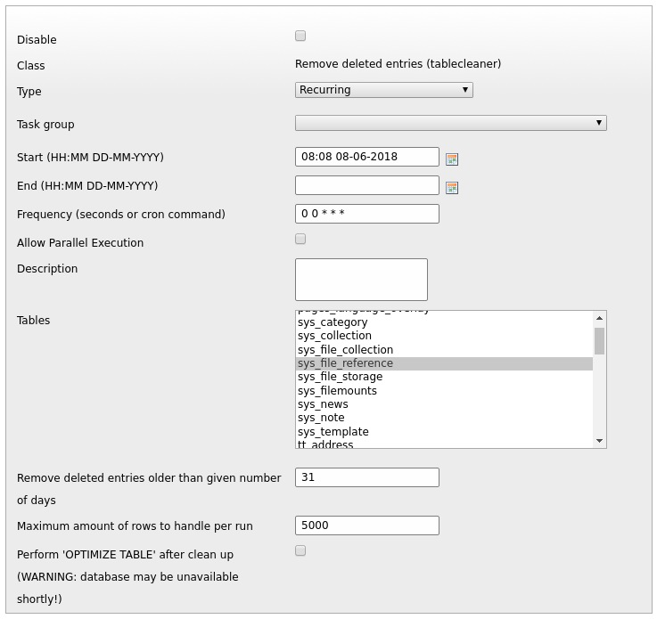
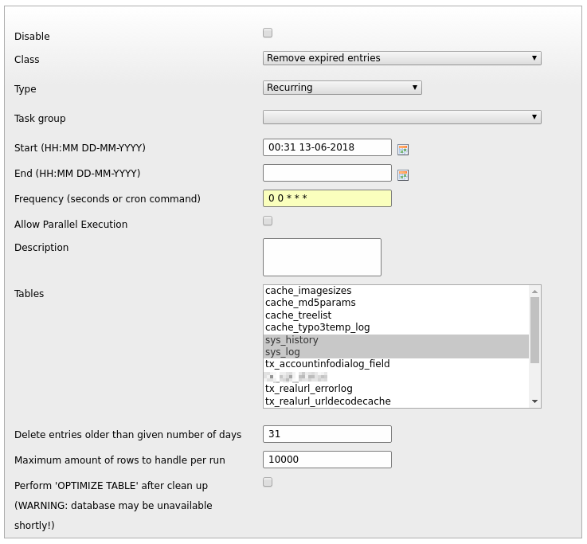
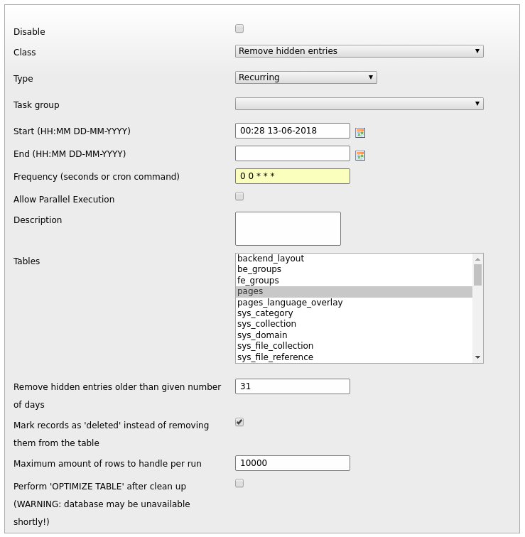

# TYPO3 extension: tablecleaner
Removes [deleted/hidden] records older than [N] days from tables.

When a record is deleted in TYPO3, most of the times it is not actually deleted. Many tables just set a value of 1 on the 'deleted' field. Some sites can get pretty big and a lot of content is added and removed. This means that some tables will fill up with deleted records.

There are also tables that just keep on growing. Take sys_log for example. That logs system events from the time the system was first started to the present day. In some installations the sys_log also contains a lot of PHP error messages. I have seen sys_log tables of multiple GigaBytes in size.

Also sometimes editors mark content 'hidden' to re-use it on some later date. This day may never come. It Is not uncommon to see hidden content from two years ago that is just sitting there taking up valuable space.

This extension provides a scheduler task for 'cleaning up' ever growing tables by supplying three different cleanup tasks:
* Remove deleted entries from the database older than N days
* Remove (or mark as deleted) hidden entries from the database older than N days
* Remove any entries from the database older than N days

For these tasks a 'tstamp' field is required. If this field is not present in the table, it will not show up in the table listings.

## Installation
Install it using composer:
```bash
composer require michielroos/tablecleaner
```

Or clone it
```bash
git clone https://github.com/Tuurlijk/t3ext-tablecleaner.git tablecleaner
```

### Usage
In the scheduler you will find three new tasks:
* Table Cleaner: remove deleted entries (tablecleaner)
* Table Cleaner: remove expired entries (tablecleaner)
* Table Cleaner: remove hidden entries (tablecleaner)
You can set a retention time in days for each task. If you need different retention times for different tables, just create separate tasks for each table and time combination.

You can find these options in page properties under the visibility section on the 'Access' tab.

There is one exclusion to this rule; when cleaning the pages table, the pages themselves will be excluded from the cleaning process.

You can also recursively exclude pages from the cleaning process.
#### Remove deleted entries
In the table cleaner task, you can select one or more tables for cleaning. You can also specify a number of days after which to actually remove the deleted records from the table. The default is 31 days.



If you wish to set different retentions for different tables, you can create multiple scheduler tasks and then specify a different retention time for each task.

#### Remove expired entries
In the remove expired entries task, you can select one or more tables for cleaning. You can also specify a number of days after which to remove the records from the table. The default is 31 days.

_*NB! Please note that this task is the most aggressive cleaner since it ignores the deleted and hidden flags and only looks at the 'tstamp' field when removing records.*_



If you wish to set different retentions for different tables, you can create multiple scheduler tasks and then specify a different retention time for each task.

#### Table Cleaner: remove hidden entries
In the remove hidden entries task, you can select one or more tables for cleaning. You can also specify a number of days after which to remove the hidden records from the table. The default is 31 days.



Instead of outright deleting the hidden records from the table, the cleaner can mark them as being 'deleted'. If the checkbox 'Mark records as deleted' is checked, the timestamp of the expired records will be touched and the records will be marked as 'deleted'.

This will give another option to build in a 'grace period' for editors that like to 'archive' their unused content by marking it as deleted. When they discover their once hidden records have now vanished from the backend, we can still restore them from the recycle bin.

If you wish to set different retentions for different tables, you can create multiple scheduler tasks and then specify a different retention time for each task.

### Overview of excluded pages
There is a backend module that shows you an overview of what pages and branches are excluded in the TYPO3 page tree or any selected branch.

Clicking on a page title will bring you straight to the page properties of that page.

## Roadmap
* Use DataHandler

## Known problems
If you find any problems, [please report them](https://github.com/Tuurlijk/t3ext-tablecleaner/issues).

Please take some time and make a proper report stating at least:
* version of the extension
* reproducibility
* steps to reproduce
* observed behavior
* expected behavior
Writing a good bug report will help us to fix the bugs faster and better.
